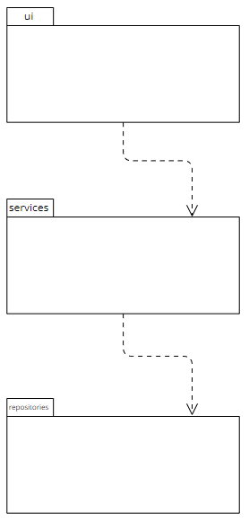
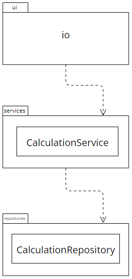

# Architectural illustration

## Structure



Package _ui_ contains user interface, _services_ contains application logic and _repositories_ contains code corresponsible for saving calculations.

## Application logic

Class CalculationService forms and responds for application logic, which represents different calculations and their storage through CalculationRepository.

```mermaid
 classDiagram
     class CalculationService{
     CalculationService: string_to_number()
     CalculationService: sum_service()
     CalculationService: sub_service()
}


