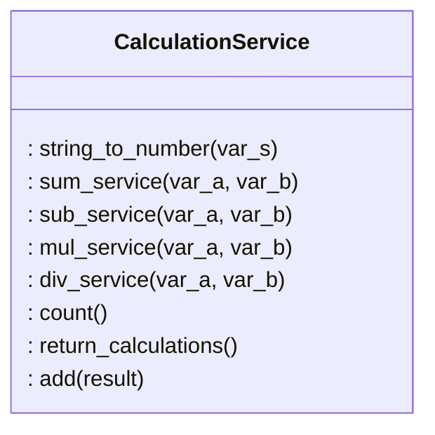

# Architectural illustration

## Structure

Package _ui_ contains user interface, _services_ contains application logic and _repositories_ contains code corresponsible for saving calculations.

## Application logic

Class CalculationService forms and responds for application logic, which represents different calculations and their storage through CalculationRepository.

