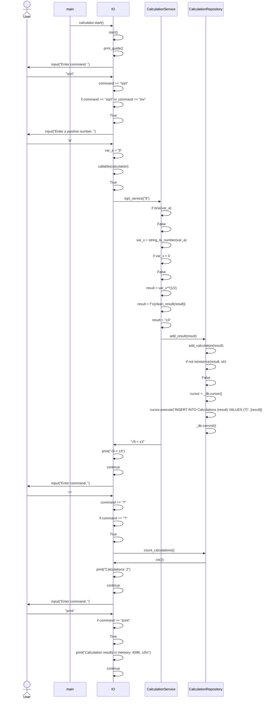
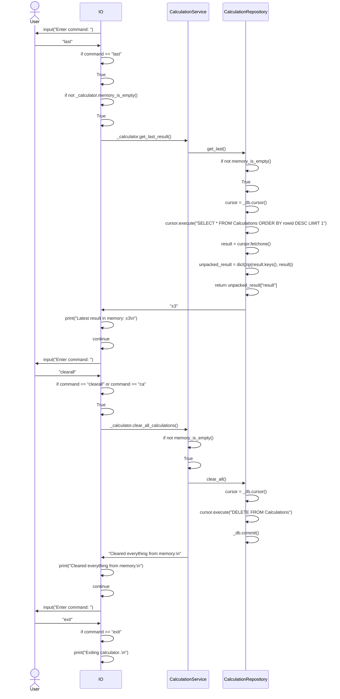

# Architectural illustration

## Structure

Package _ui_ contains user interface, _services_ contains application logic and _repositories_ contains code corresponsible for saving calculations.

## Application logic

Class _CalculationService_ forms and responds for application logic, which represents different calculations and their storage through _CalculationRepository_.

_CalculationService_ can access and manage calculations in sqlite3 database memory through _CalculationRepository_.

## Main functionalities

Sequence diagram illustrating functionality of the application calculating 2 to the power of 12.

Illustration of application calculating the square root of 9, returning count and result of calculations in memory.  

Illustration of fetching last result in memory and clearing memory, while calculator is still running from the state of previous diagram.  

