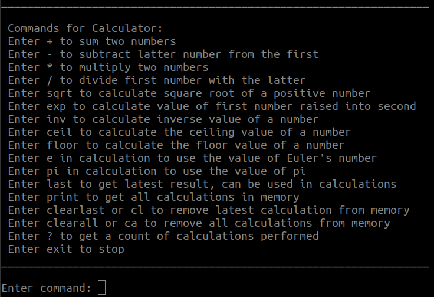
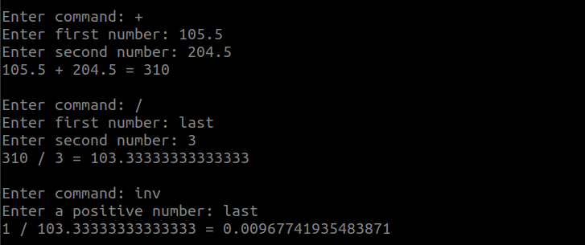
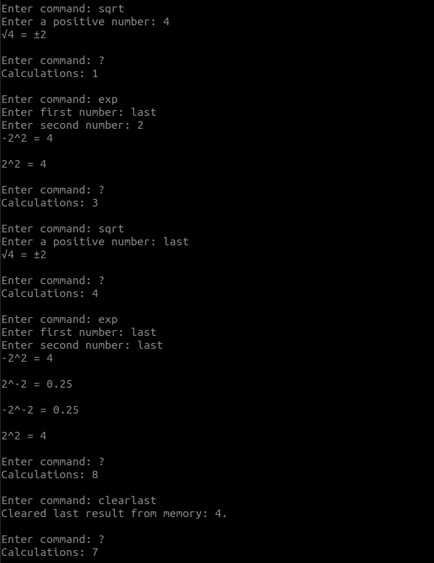

# User manual

## Input and output

**Input and output numbers are in base-10 and they can be integer or decimal separated with a dot(.) e.g. 2.5, 0.75, 3.1415.**  

*Input and output can also be expressed in powers of ten e.g. 1e3 (represents 10^3 = 1000), 10e3 (represents 10\*10^3 = 10000), 10e-3 (represents 10\*10^-3 = 0.01) or 1e-3 (represents 10^-3 = 0.001).*


## Installation
- Install dependencies
```bash
poetry install
```

- Start application
```bash
poetry run invoke start
```

**Remember to use a dot . for decimal part representation e.g. 2.5, 0.75, 3.1415**

**Do not input decimals as fractions e.g. 1/2, 3/8 or 1/10, these won't be processed**

## Start

Program opens a TUI (text-based user interface) that shows available commands.


## Usage

Type command followed by an enter key.  Program can show 17 decimal places of digits.



A square root will result in a plusminus answer, that will count as one calculation.  When used with 'last' command, calculator will however calculate both negative and positive outcomes which each will count as a calculation.

