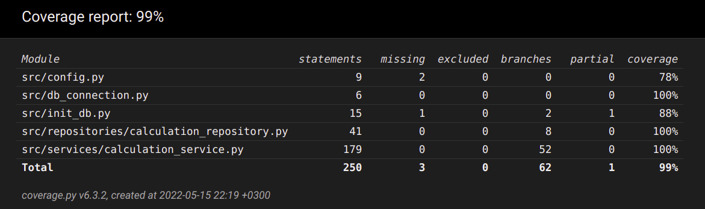

# Testing document

Application has been tested by automated unit- and integration tests with unittest, aswell with manual system testing.  

## Unit- and integration testing

### Application logic

Class `CalculationService` that forms and responds for application logic is being tested by class [TestCalculationService](https://github.com/n0spoon/ot-harjoitustyo/blob/master/src/tests/services/calculation_service_test.py).  

### Repository classes

Class `CalculationRepository` that is responsible for long-term storage of calculation results in application memory is being tested by class [TestCalculationRepository](https://github.com/n0spoon/ot-harjoitustyo/blob/master/src/tests/repositories/calculation_repository_test.py).  Test database name is set in _.env.test_ -file, so that the application will use a different database for testing.  

### Test coverage

Excluding the user interface layer, branch coverage for testing is 99%.  

## System testing

System testing of the application has been performed manually by the author in Linux environment.  Invalid and error-raising inputs have been checked, keyboard interrupts have not been altered to avoid problematic situations where user cannot exit the application.

### Installation and configuration

Application has been fetched, installed and tested according to instructions in the [user manual](https://github.com/n0spoon/ot-harjoitustyo/blob/master/dokumentaatio/kayttoohje.md) on a Cubbli Linux laptop.  

### Functionalities

All of the implemented functionalities in the [definition document](https://github.com/n0spoon/ot-harjoitustyo/blob/master/dokumentaatio/vaatimusmaarittely.md) have been tested.  
