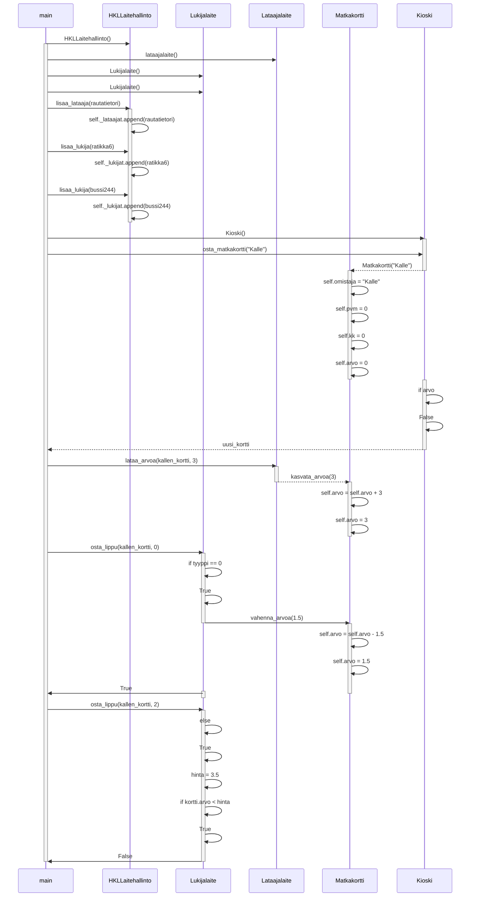

```mermaid
 sequenceDiagram
     participant m as main
     participant hkl as HKLLaitehallinto
     participant lula as Lukijalaite
     participant lala as Lataajalaite
     participant mk as Matkakortti
     participant k as Kioski

     m->>hkl: HKLLaitehallinto()
     activate m
     m->>lala: lataajalaite()
     m->>lula: Lukijalaite()
     m->>lula: Lukijalaite()
     m->>hkl: lisaa_lataaja(rautatietori)
     activate hkl
     hkl->>hkl: self._lataajat.append(rautatietori)
     m->>hkl: lisaa_lukija(ratikka6)
     hkl->>hkl: self._lukijat.append(ratikka6)
     m->>hkl: lisaa_lukija(bussi244)
     hkl->>hkl: self._lukijat.append(bussi244)
     deactivate hkl
     m->>k: Kioski()
     activate k
     m->>k: osta_matkakortti("Kalle")
     k-->>mk: Matkakortti("Kalle")
     activate mk
     deactivate k
     mk->>mk: self.omistaja = "Kalle"
     mk->>mk: self.pvm = 0
     mk->>mk: self.kk = 0
     mk->>mk: self.arvo = 0
     deactivate mk
     activate k
     k->>k: if arvo
     k->>k: False
     k-->>m: uusi_kortti
     deactivate k
     m->>lala: lataa_arvoa(kallen_kortti, 3)
     activate lala
     lala-->>mk: kasvata_arvoa(3)
     activate mk
     deactivate lala
     mk->>mk: self.arvo = self.arvo + 3
     mk->>mk: self.arvo = 3
     deactivate mk
     m->>lula: osta_lippu(kallen_kortti, 0)
     activate lula
     lula->>lula: if tyyppi == 0
     lula->>lula: True
     lula->>mk: vahenna_arvoa(1.5)
     deactivate lula
     activate mk
     mk->>mk: self.arvo = self.arvo - 1.5
     mk->>mk: self.arvo = 1.5
     lula->>m: True
     activate lula
     deactivate lula
     deactivate mk
     m->>lula: osta_lippu(kallen_kortti, 2)
     activate lula
     lula->>lula: else
     lula->>lula: True
     lula->>lula: hinta = 3.5
     lula->>lula: if kortti.arvo < hinta
     lula->>lula: True
     lula->>m: False
     deactivate lula
     deactivate m
```
