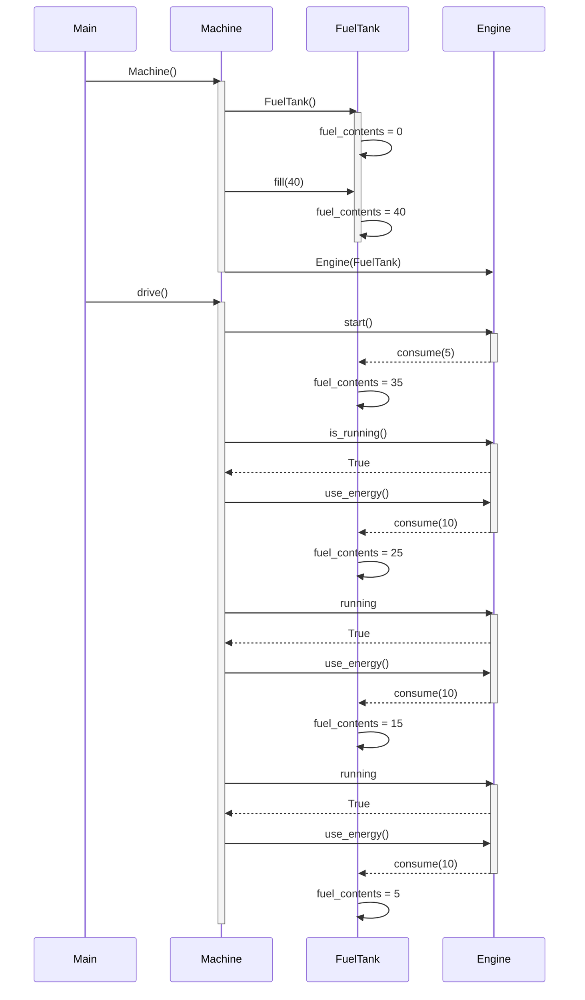

```mermaid
 sequenceDiagram
     Main->>Machine: Machine()
     activate Machine
     Machine->>FuelTank: FuelTank()
     activate FuelTank
     FuelTank->>FuelTank: fuel_contents = 0
     Machine->>FuelTank: fill(40)
     FuelTank->>FuelTank: fuel_contents = 40
     deactivate FuelTank
     Machine->>Engine: Engine(FuelTank)
     deactivate Machine
     Main->>Machine: drive()
     activate Machine
     Machine->>Engine: start()
     activate Engine
     Engine-->>FuelTank: consume(5)
     deactivate Engine
     FuelTank->>FuelTank: fuel_contents = 35
     Machine->>Engine: is_running()
     activate Engine
     Engine-->>Machine: True
     Machine->>Engine: use_energy()
     Engine-->>FuelTank: consume(10)
     deactivate Engine
     FuelTank->>FuelTank: fuel_contents = 25
     Machine->>Engine: running
     activate Engine
     Engine-->>Machine: True
     Machine->>Engine: use_energy()
     Engine-->>FuelTank: consume(10)
     deactivate Engine
     FuelTank->>FuelTank: fuel_contents = 15
     Machine->>Engine: running
     activate Engine
     Engine-->>Machine: True
     Machine->>Engine: use_energy()
     Engine-->>FuelTank: consume(10)
     deactivate Engine
     FuelTank->>FuelTank: fuel_contents = 5
     deactivate Machine
```
