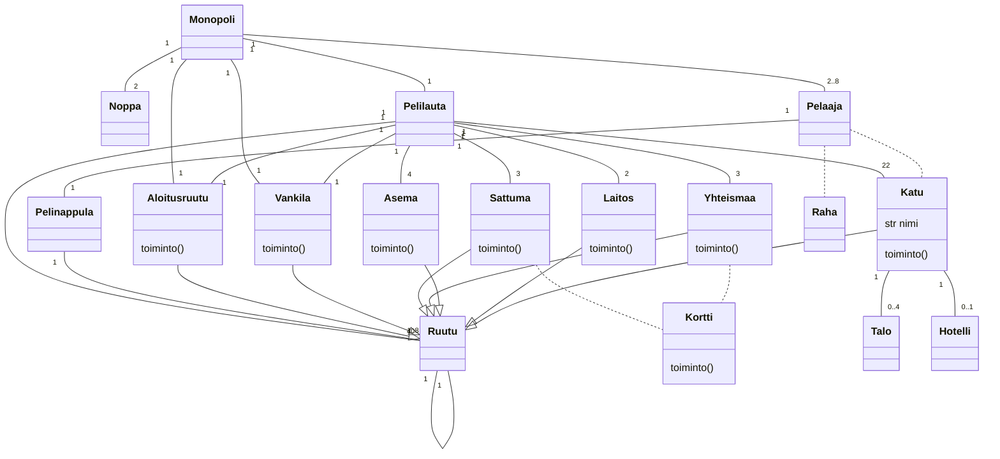

## Sovelluslogiikka

```mermaid
 classDiagram
     Monopoli "1" -- "2" Noppa
     Monopoli "1" -- "2..8" Pelaaja
     Monopoli "1" -- "1" Pelilauta
     Pelilauta "1" -- "40" Ruutu
     Ruutu "1" -- "1" Ruutu
     Pelaaja "1" -- "1" Pelinappula
     Pelinappula "1" -- "1..8" Ruutu
     Monopoli "1" -- "1" Aloitusruutu
     Monopoli "1" -- "1" Vankila
     Pelilauta "1" -- "1" Aloitusruutu
     Pelilauta "1" -- "1" Vankila
     Pelilauta "1" -- "3" Sattuma
     Pelilauta "1" -- "3" Yhteismaa
     Pelilauta "1" -- "4" Asema
     Pelilauta "1" -- "2" Laitos
     Pelilauta "1" -- "22" Katu
     Aloitusruutu --|> Ruutu
     Vankila --|> Ruutu
     Sattuma --|> Ruutu
     Yhteismaa --|> Ruutu
     Asema --|> Ruutu
     Laitos --|> Ruutu
     Katu --|> Ruutu
     Aloitusruutu: toiminto()
     Vankila: toiminto()
     Sattuma: toiminto()
     Yhteismaa: toiminto()
     Asema: toiminto()
     Laitos: toiminto()
     Katu: toiminto()
     Katu: str nimi
     Sattuma .. Kortti
     Yhteismaa .. Kortti
     Kortti: toiminto()
     Katu "1" -- "0..4" Talo
     Katu "1" -- "0..1" Hotelli
     Pelaaja .. Katu
     Pelaaja .. Raha
```
